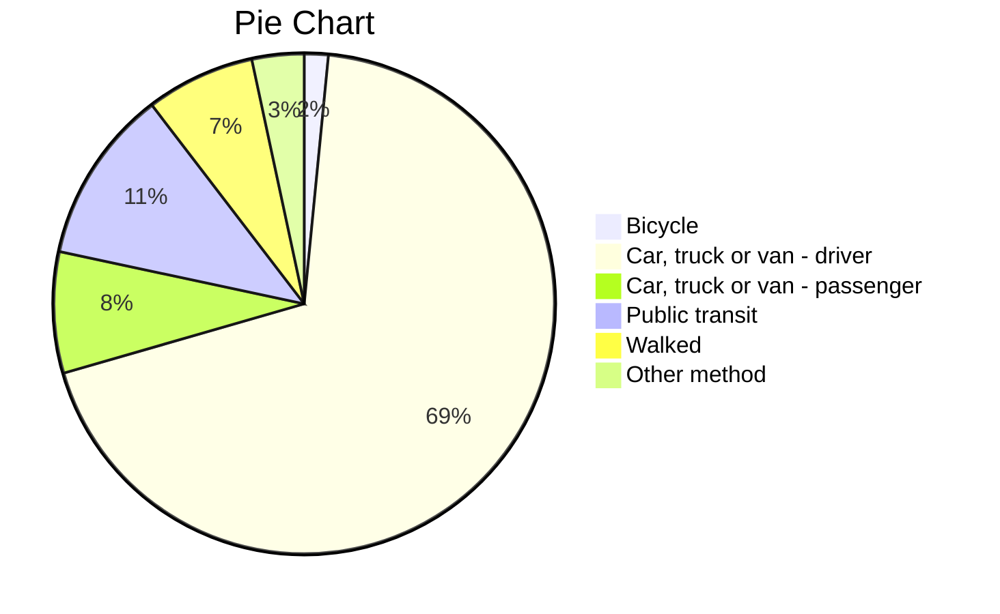

**Nov. 6, 2025** 
**JOU4100, Digital Journalism II** 
**Liam Fox, Noah Leafloor, and Luke Lau** 
**Presented to Jean-Sébastien Marier** 

# Exploratory Data Analysis (EDA) & Pitch

## EDA of the City of Ottawa's 2021 Census and Ward Data 

## 1. Introduction

In our Exploratory Data Analysis (EDA) assignment, our group of Digital Journalism students at the University of Ottawa will analyze data from the [City of Ottawa’s 2021 Long Form Census - Ward Data](https://open.ottawa.ca/datasets/ottawa::2021-long-form-census-ward-data/about). 

The data in the Census — which aims to collect data regarding demographic, social and economic characteristics representative of the entire population — was collected through questionnaires sent to all households in Ottawa by Statistics Canada as part of their National Census.

 The City originally published the dataset on November 28, 2023 and it was last updated on October 19, 2024. The City’s open Census data is updated in tandem with each National Census, which is collected every five years (Statistics Canada, 2021). Updated Ward and City data is expected to be presented in 2028, as the Census data will need to be processed after its collection in 2026. 
 
 Eva Walrond, who works for the City’s Planning, Real Estate and Economic Development department, is the steward of the 2021 Long Form Census Data. 
 
 The dataset includes information about Ottawa residents’ income, ethnicity, nationality, spoken languages, education and employment, among other variables. 

The original dataset published on the City of Ottawa’s open data portal can be found and downloaded [here](https://open.ottawa.ca/datasets/ottawa::2021-long-form-census-ward-data/about). 

The CSV file for the raw and unchanged dataset we will be examining in our EDA can be found and downloaded [here](https://raw.githubusercontent.com/jsmarier/files-for-course-assignments/refs/heads/main/2021_Long_Form_Census_-_Ward_Data.csv) 

First, for our EDA assignment, we will explain the process of exporting a dataset in Google Sheets and note some general and specific observations about the data in the **Getting Data** section. 

Next, we will conduct a VIMO (valid, invalid, missing, outliers) analysis, clean our dataset and summarize key findings in the **Understanding Data** section. 

After this, we will pitch a story idea we gathered from our data analysis of the City of Ottawa’s Census in the **Potential Story** section.

 Last, we will cite the relevant course and research materials we consulted for our EDA in the **References** section. 

## 2. Getting Data

To import the raw [dataset](https://raw.githubusercontent.com/jsmarier/files-for-course-assignments/refs/heads/main/2021_Long_Form_Census_-_Ward_Data.csv) into [Google Sheets](https://docs.google.com/spreadsheets/d/1r-4qwR_3zLg95GB5UP3KQ-1nzTT0DsBS9QNl8Lruv88/edit?gid=0#gid=0), we manually input the GitHub repository [CSV file](https://raw.githubusercontent.com/jsmarier/files-for-course-assignments/refs/heads/main/2021_Long_Form_Census_-_Ward_Data.csv) by inserting its URL with the import data function  —  _IMPORTDATA=“url”_  —  in the A1 cell, in accordance with the "Cleaning Data in Google Sheets" video lecture for this course (Marier, 2021).

The full function in cell A1 of our dataset was formatted as such:
`=IMPORTDATA("https://raw.githubusercontent.com/jsmarier/files-for-course-assignments/refs/heads/main/2021_Long_Form_Census_-_Ward_Data.csv")`

 

*Figure 1: Screen capture of the dataset in Google Sheets immediately after importation.* 

The public link to the dataset in our Google Sheets spreadsheet can be found [here](https://docs.google.com/spreadsheets/d/1r-4qwR_3zLg95GB5UP3KQ-1nzTT0DsBS9QNl8Lruv88/edit?gid=0#gid=0)

The full City of Ottawa 2021 Long Form Census dataset in Google Sheets is 26 columns by 2,603 rows. 

On its face, the data looks clear and accurate, although it is hard to digest due to the extensive quantity of demographic sample data included in the Census.

The columns are separated by each ward in the City of Ottawa, as well as cumulative data for the entire city summed from every ward. 

The order and labeling of all 24 wards are correct, according to the [City of Ottawa’s Mayor and City Councillors Directory](https://ottawa.ca/en/city-hall/mayor-and-city-councillors). 

The rows are organized by labels in the first column, each describing a different variable, and the corresponding values for each ward and the city as a whole are listed in the rest of the columns. 

For example, the 12th row in the dataset lists the number of people who are 30 to 34 years old in Ottawa’s total population for each ward and the entire city. 

While the data appears to be clean, for the most part, the full Census dataset is too overwhelming to conduct a thorough analysis. Therefore, we decided to focus our data analysis on the section of the dataset about commuting methods, durations, and times for the employed labour force aged 15 years or older with a usual place of work in Ottawa detailed in the 2021 Census. 

 Our group created [another sheet](https://docs.google.com/spreadsheets/d/1r-4qwR_3zLg95GB5UP3KQ-1nzTT0DsBS9QNl8Lruv88/edit?gid=1160608891#gid=1160608891), copying the data from rows 2575 to 2595 from the raw, original dataset into a more digestible dataset on commuting behaviour. 

 All of the variables we analyzed in our dataset about commuting habits in the City of Ottawa are continuous variables.

 
According to Statistics Canada’s [Power from Data handbook](https://www150.statcan.gc.ca/n1/edu/power-pouvoir/ch8/5214817-eng.htm), a variable is continuous if “it can assume an infinite number of real values within a given interval" (Statistics Canada, 2021).

The variables in our dataset measure the number of people in a population, which can assume an infinite number of real values and has a meaningful zero. 

For instance, row four in our commuting behaviour dataset features continuous variables about people aged 15 or over in the labour force who commute by driving a car, van, or truck to their place of work in each ward of the City of Ottawa. 

Column P in our condensed dataset features continuous variables about the commuting habits of Somerset Ward residents in the labour force aged 15 or over.

 Row 18 features continuous variable observations about the number of people across the city who leave for work between 6:00 to 6:59 a.m. 

 
Our group observed that while over 210,000 people aged 15 or over in Ottawa’s labour force use a motor vehicle to commute to work, only about 64,000 people — which is under 25% of the sample — reported using other methods such as public transit, walking, or biking to get to work. 

Based on this observation, our group formulated the hypothesis that the City of Ottawa and other levels of government — amid efforts to reduce carbon emissions and combat climate change — are promoting and investing in initiatives that incentivize alternative methods of transportation, such as public transit and active transportation infrastructure.

Our observation that the large majority of the labour force who commute to work in Ottawa drive a personal motor vehicle also led us to wonder, “Is Ottawa more car-centric than other major Canadian cities and if so, why?” 

## 3. Understanding Data

### 3.1. VIMO Analysis

 
*Figure 2: Screen capture of a table showcasing the results of our VIMO analysis, accounting for invalid, missing and outlier values.*
 
Methods for exploring the validity and correctness of the data was done through a vimo analysis. Following Statistics Canada’s guide for “Data Accuracy and Validation: Methods to ensure the quality of data,” a vimo analysis was conducted where the accuracy and validity was assessed (Statistics Canada).

Focusing on the dataset, finding any invalid, missing, or outlier values was done to determine the quality and validity. No errors or outliers were detected. 

The data is continuous as it has an infinite number of possible values within a given interval. Additionally, twenty five per cent sample data was collected for the commuting methods, duration, and time for all 24 wards.

For exploring the correctness of the data, the 2016 total census for wards one to 23 was the best option for comparing the 2021 data. The 2016 census was then explored and found comparable data like methods of transportation, duration, and time. However, since 2016, the number of wards has expanded to 24 — a disparity reflected between the two census datasets. 

The 2016 Census dataset also broke up the three identified columns (method, duration, time) between gender. 

While analyzing the correctness of the data, the 2016 Census also collected a 25 per cent sample. The population was roughly proportionate as it only went up slightly in 2021. Furthermore, since the data is from the City of Ottawa, the accuracy is trusted more.

The 2021 dataset was explored for its validity and correctness of data after choosing to focus on the commuting census. There was little to improve since the vimo analysis was not large. The level of accuracy is trusted since the data comes from the City of Ottawa’s official census and Statistics Canada. Additionally, it is difficult to measure and find other sources of the focused data, because it is about duration and time along methods for transportation.

### 3.2. Cleaning Data

After VIMO analysis, which determined that the condensed dataset had no significant invalid, missing, or outlier values, the data cleaning process focused primarily on ensuring the data’s accuracy, consistency, and usability for analysis. The following key steps within Google Sheets were performed:

#### Improving Readability 
Freezing Panes: To enhance the dataset’s usability, we followed the “Cleaning Data in Google Sheets” video tutorial (Marier, 2021) and the top header row (including the ward names) and the first column (‘Characteristics’) is frozen. This action ensures that the labels remain visible while scrolling and making it much easier to cross-reference data points accurately.

#### Standardizing Column Headers 
Using <code>SPLIT</code>: Following the “Cleaning Data in Google Sheets” video tutorial (Marier, 2021), the original column headers combined the ward’s name and its number. To standardize these headers for cleaner analysis, the <code>SPLIT</code> function is applied. This separated the descriptive name from the ward number into two distinct rows.

#### Ensuring Data Integrity
Data Cleanup Tools: To guarantee data integrity, the ‘Data cleanup’ tools available in Google Sheets are run. The ‘Trim whitespace’ function is run on the ‘Characteristics’ column. This is a necessary step, as the inspection of the raw data revealed that some data labels contained invisible leading spaces. Removing these spaces is important for preventing errors when using filters or creating pivot tables, ultimately making the tables and charts far more reliable and readable.

*Figure 3: Screen capture of dataset after the cleaning process.*

### 3.3. Exploratory Data Analysis (EDA)

#### Pivot Table

|Characteristics                           |SUM of City of Ottawa|
|------------------------------------------|---------------------|
|Bicycle                                   |                 4265|
|Car, truck or van - **as a driver**       |               190185|
|Car, truck or van - **as a passenger**    |                21570|
|Public transit                            |                31015|
|Walked                                    |                19400|
|Other method                              |                 9265|
|**Grand Total**                           |           **275700**|

*Figure 4: Screen capture of a pivot table representing commuting methods for the employed labour force aged 15 or over in the City of Ottawa, according to 2021 Census data.*
#### Exploratory Chart

*Figure 5: PNG file of a pie chart created in Google Sheets visualizing the proportional distribution between commuting methods for the employed labour force aged over 15 in Ottawa.* 

We chose to analyze the commuting methods for the City of Ottawa variables we wanted to assess how people commute across the city. More specifically we wanted to analyse the disparity between using personal vehicles to commute versus alternative methods such as public transit, walking and biking for the employed labour force in Ottawa. 

It stood out to us that 76.8 per cent of Ottawa’s employed labour force over the age of 15 drove to work, as opposed to less than 25 per cent using alternative methods of transportation to commute. We have presented this data in a Google Sheets pivot table and pie chart, as well as in the Table and Pie Chart functions in Markdown.

Statistics Canada writes that pie charts are "best used for displaying statistical information when there are no more than six components only — otherwise, the resulting picture will be too complex to understand" in its *Power from Data* handbook (Statistics Canada, 2021). 

Our chart displayed six categories, therefore the pie chart was an effective visual format to simplistically convey our data's focus on how commuting methods are divided in Ottawa. 

Therefore, we were curious as to why the large majority of commuters used personal vehicles to get to work and how they could be incentivized to use a more eco-friendly alternative method, leading us to consider pursuing a story about what initiatives and investment the City of Ottawa is undertaking to improve public and active transportation infrastructure across the city. 

We think the variables about commuting time warrant further investigation because they influence the commuting method people in the city use. 

For example, if it takes a person 30 minutes to drive to work, public transit may not be an appealing alternative because it takes an unrealistic amount of time.  

## 4. Potential Story

Public transit is a growing part of Ottawa as a good portion of laborers depend on it. However, driving being 76.8 per cent of the labour force, which is from 25 per cent sample data, is the leading method of transportation. Why is that? This is the question we seek to answer.

What we know is in the coming years, the city of Ottawa will have and continue to be improving road quality and public transit infrastructure. Specifically, investing in the O-Train extension lines and the zero-emission bus program. Therefore, a story about how the City of Ottawa is planning to invest and upgrade its public transit infrastructure to meet demand for more reliable and expanded service, using commuting methods and duration data as a reference point for how dependent the city’s labour force is on personal vehicles. 

To tell this story, interviewing sources like City Councillor and Transit Committee Chair Glen Gower, would give the story an expert insight into why such a high percentage of commuters use personal vehicles in Ottawa and what the city is doing to improve public transit infrastructure to make a more compelling alternative to commuters. Perhaps having a perspective on commuting time improvements for those who live outside of the city, could swing people in favor of using public transit. Additionally, interviewing a representative from Ottawa Transit Riders, “a non-partisan, membership-based, advocacy group, working to make Ottawa’s transit system more reliable, affordable, accessible, and safe,” would be another good idea because they have a board of directors who can answer on what improvements the city is doing to have more workers use public transit (Ottawa Transit Riders, 2025).

I found relevant sources such as a CBC article on Ottawa’s $1B transit project, highlighting the zero-emission buses (Skura, 2025). I also found the Ottawa Transit Rider’s Board of Directors page, which can be a useful list of potential interviews.

  Additionally, Glen Gower released a piece from his notebook series where he writes about his week without driving (Gower, 2025) He also wrote about OC Transpo’s recent reliability in October, which makes him a great candidate to interview. 
  

## 5. Conclusion

In summary, our team encountered several significant challenges. Liam found that it was difficult to determine what to focus on in this large dataset, making it hard to establish a clear story idea from the original dataset. Noah found that it was challenging to perform Markdown functions and narrow down a precise story idea. For Luke, the main hurdle was technical issues; Markdown was unfamiliar and it was not easy to convert different formats or styles into Markdown, or apply Markdown functions for things like tables, sheets, hyperlinks, etc.

Although by overcoming these challenges, the process proved extremely rewarding. The most rewarding aspect for Noah was the process of using Google Sheets to create data visualizations and identifying the outline of the story that we were creating. Liam enjoyed the process of turning raw, intangible data into a comprehensive story idea through in-depth analysis, utilizing various tools such as Google Sheets pivot tables, data visualizations and other complementary sources. He also enjoyed learning the technicalities of navigating GitHub and Markdown. For Luke, the greatest reward came from solving technical issues; understanding how to apply Markdown functions was a big achievement.

This project also prompted some final thoughts. Even though we thought that coding was far removed from journalism, as two completely different fields of knowledge, throughout our EDA, we found that basic coding can be an incredibly valuable skill for generating data-driven stories and in enterprise journalism as a whole. Looking back, we could have improved our workflow by setting more specific research questions to enhance efficiency from the beginning of the analysis. If we were to do the project again, we probably would have examined a more specified dataset to generate a more specific story idea, or used other methods such as ATI laws to find data that isn't already publicly available and uncover new information.

## 6. References

Board of directors / conseil d’administration. (2021). Ottawa Transit Riders / Le Groupe Des Usagers de Transport En Commun D’Ottawa. [https://www.ottawatransitriders.ca/board_of_directors_conseil_d_administration](https://www.ottawatransitriders.ca/board_of_directors_conseil_d_administration)

Data Accuracy and Validation: Methods to ensure the quality of data. (2020, September 23). Www.statcan.gc.ca. [https://www.statcan.gc.ca/en/wtc/data-literacy/catalogue/892000062020008](https://www.statcan.gc.ca/en/wtc/data-literacy/catalogue/892000062020008)

Gower, G. (2025, October 8). NOTEBOOK: (Almost) a week without driving - Glen Gower | Councillor / Conseiller | Stittsville. Glen Gower | Councillor / Conseiller | Stittsville. [https://glengower.ca/community/notebook-almost-a-week-without-driving/](https://glengower.ca/community/notebook-almost-a-week-without-driving/)

In-Text Citations. (2019). American Psychological Association. 
[https://apastyle.apa.org/style-grammar-guidelines/citations](https://apastyle.apa.org/style-grammar-guidelines/citations)

Marier, Jean-Sébastien. (2021, October). Cleaning Data in Google Sheets [Video]. YouTube. [https://www.youtube.com/watch?v=U4yigiawIEU&t=111s](https://www.youtube.com/watch?v=U4yigiawIEU&t=111s)

Skura, E. (2025, February 18). Inside Ottawa’s next $1B transit project. CBC. [https://www.cbc.ca/news/canada/ottawa/inside-ottawa-s-next-1b-transit-project-1.7453280](https://www.cbc.ca/news/canada/ottawa/inside-ottawa-s-next-1b-transit-project-1.7453280)

Statistics Canada. (2021, November 17). Guide to the census of population, 2021, chapter 1 – introduction. [https://www12.statcan.gc.ca/census-recensement/2021/ref/98-304/2021001/chap1-eng.cfm]([https://www12.statcan.gc.ca/census-recensement/2021/ref/98-304/2021001/chap1-eng.cfm) 

Statistics Canada. (2021, September 2). Statistics: Power from Data! [https://www150.statcan.gc.ca/n1/edu/power-pouvoir/toc-tdm/5214718-eng.htm](https://www150.statcan.gc.ca/n1/edu/power-pouvoir/toc-tdm/5214718-eng.htm) 